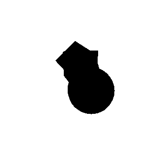
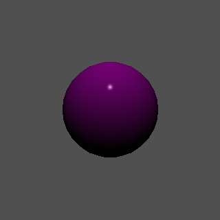
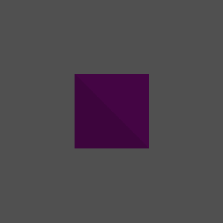

<h1>Animated Scene Renderer</h1>
<p>Python renderer that uses a runner script and mesh (.stl) files to create a gif of the animated scene defined in the runner script.</p>


<h2>Features</h2>
<ul>
  <li>
    <h4>Scene Creation</h4>
    <p>A render is constructed of a light object, a camera object, and a list of one or more meshes.</p>
    <p>All objects can be created using the constructor of their specific scripts, although the mesh object requires a path to a mesh.stl file to be constructed.</p>
  </li>
  <li>
    <h4>Transform Control and Animation</h4>
    <p>Every camera, light, and mesh object has a transform, which allows for modifiable and animatable position and rotation values. Any of the x, y, z in setting a transform position or rotation can also take an AnimationCurve in its place, and will use that to animate the value throughout the rendering.</p>
    <p>An AnimationCurve acts as a field that changes over the lifetime of the animation. It is defined by a list of keyframes for values, what time they occur at, and how the values should be interpolated.</p>
  </li>
  <li>
    <h4>Material and Color Settings</h4>
    <p>Both meshes and light objects take a color value that allows users to define meshes of different colors and lights that shine a specific color. Additionally, the render itself takes an ambient light color as a base color applied to rendered meshes.</p>
    <p>Meshes additionally have fields to define their material, allowing users to define how much the ambient, diffuse, or specular lighting affects the specific mesh. There is also a Phong exponent field which defines how reflective or shiny the mesh should be rendered, most notable in the Phong shading renders.</p>
  </li>
  <li>
    <h4>Render Settings</h4>
    <p>There are five offered shading algorithms, selected from in the runner script. Among them are Flat shading, Phong shading, Depth shading, Barycentric shading, and no shading. More information and examples can be found in the <a href="#render_styles">Render Styles</a> section.</p>
  </li>
</ul>


<h2>Creating Animations</h2>
<p>Below is an example runner script broken into parts. When implementing the runner, all parts should be in the same runner file, and the runner file should be in the animation_runners folder or have its filepaths properly adjusted.</p>

<h3>Define scene objects</h3>
<p>First, a Screen, Camera, Light, and all desired Mesh objects should be created.</p>
<p>Note that the size of the screen is the resolution of the final gif.</p>
<p>Also note that both perspective and orthographic cameras in camera.py are able to serve as the render camera.</p>

```python
from screen import Screen
from camera import PerspectiveCamera, OrthoCamera
from light import PointLight
from mesh import Mesh

# Defines a 500 by 500 canvas for the image
screen = Screen(500,500)

# A camera can be either an OrthoCamera (orthographic) or PerspectiveCamera, both use the same arguments
# Defines a camera with the bounding box of (left, right, bottom, top, near, far)
camera = PerspectiveCamera(-1.0, 1.0, -1.0, 1.0, 1.0, 10)
camera.transform.set_position(0, -2.5, 1)

# Defines a light with arguments (intensity, color[r, g, b] with values between 0 and 1)
light = PointLight(50.0, [1, 1, 1])

# Defines a mesh with arguments (filepath to stlfile, diffuse color, specular color, ambient componenet, diffuse component, specular componenet, phong exponent)
mesh_1 = Mesh.from_stl("../unit_sphere.stl", [1.0, 0.0, 1.0], [1.0, 1.0, 1.0], 0.05, 1.0, 0.5, 100)
mesh_2 = Mesh.from_stl("../unit_cube.stl", [0.0, 1.0, 0.0], [1.0, 1.0, 1.0], 0.05, 1.0, 0.5, 1000)
```

<h3>Animation curves and setting fields</h3>
<p>Next, scene objects can be modified. The most notable functions are each objects' transform.set_position() and .set_rotation(). Both methods can take either a numeric value or an animation curve as any of its arguments.</p>
<p>An animation curve is an animated field that interpolates its value between the previous and upcoming keyframe on every frame of the animation. The previous keyframe's interpolation type and value are used until the next keyframe is reached. When a frame is rendered after the time of the final keyframe, the value of the final keyframe will be returned. Animation should start at time 0 for expected behavior.</p>
<p>There are six interpolation values: LINEAR, EXPONENTIAL, ROOT, SINE, COSINE, and HOLD. The effect of the curve interpolation value depends on the curve type. It has no effect on LINEAR and HOLD types, it defines the power of the expression for EXPONENTIAL and ROOT types, and it defines number of cycles for SINE and COSINE types.</p>

```python
import animation_curve as curve

# Setting the positions to a static, non-animated value
camera.transform.set_position(0, -2.5, 1)
mesh_2.transform.set_position(0.0, 2.5, 0)
light.transform.set_position(0, -5, 5)

# Define an animation curve each keyframe is defined as a list of arguments inside of a list:
# ([[value_1, time_frame_begins_1, curve_interpolation_type_1, curve_interpolation_value_1],  # Keyframe 1
#   [value_2, time_frame_begins_2, curve_interpolation_type_2, curve_interpolation_value_2]])  # Keyframe 2
x_curve = curve.Curve([[-5.0, 0.0, curve.CurveType.LINEAR, 2],  # Start at -5 x
                       [5.0, 2.0, curve.CurveType.HOLD, 2]]) # Linear movement to 5 x over 2 seconds

mesh_1.transform.set_position(x_curve, 2.5, 0)
```

<h3>Rendering the scene</h3>
<p>To finish the runner script, a render must be created and run through the animation runner.</p>
<p>The render takes and organizes all scene objects. Specifically the screen, camera, list of meshes, and light.</p>
<p>The animation runner takes the render and defines the render style, background color, frames per second, and duration of animation to be created into a gif.</p>
<p>There are five defined render styles: FLAT, PHONG, DEPTH, BARYCENTRIC, and NONE. There is more information and examples below in the <a href="#render_styles">Render Styles</a> section.</p>
  
```python
from renderer import Renderer, RenderAlgorithm
import animation_runner as animate

# Creating a render requires the scene objects (screen, camera, [meshs], light)
renderer = Renderer(screen, camera, [mesh_1, mesh_2], light)

# Running the animation requires a render style (enum value shown here) and other render and animation specifications
# (renderer, shading type, background color [r, g, b] int from 0 to 255, ambient light value [r, g, b] float from 0 to 1, frames per second, animation time)
animate.run_animation(renderer, RenderAlgorithm.PHONG, [80,80,80], [0.4, 0.4, 0.4], 8, 2)
```

<h3>Output</h3>
<p>The animation runner saves an image of each frame to an "animations" directory. After the final frame is rendered, the images are compiled into a gif and deleted, leaving only the final gif in the "animations" directory. The absolute path to the animation output is printed to the console upon completion.</p>


<h2 id="render_styles">Render Styles</h2>
<p>All style examples run camera_rotate_complex.py with a separate render style, the script defines multiple meshes and orbits the camera around the meshes.</p>

<h3>FLAT</h3>
<p>Flat shading calculates one color using the normal vector of the face. The resulting color is used for the entire face.</p>
</img>

<h3>PHONG</h3>
<p>Phong shading uses barycentric interpolation to calculate a normal for each rendered pixel in a face. This gives a rounded look to flat faces, albeit at the cost of being significantly more computationally expensive than flat shading.</p>
</img>

<h3>DEPTH</h3>
<p>Depth shading ignores the light object and instead colors the meshes with a gradient, where the nearest point to the camera is pure black and the furthest point is pure white.</p>
<p>Note that the background is independent of shading style, though is altered in the following three images for more visual clarity.</p>
</img>

<h3>BARYCENTRIC</h3>
<p>Barycentric shading ignores the light object and instead calculates the color of each pixel using barycentric interpolation. One vertex in each face is colored red, blue, and green, the color is then calculated based on how near the point is to each vertex.</p>
</img>

<h3>NONE</h3>
<p>None shading is the absence of any advanced shading algorithm, each pixel representing a face is colored entirely black.</p>
</img>


<h2 id="more_examples">More Examples</h2>

<h3>object_rotate.py</h3>
<p>A sphere rotating while the camera and light remain static.</p>
<p>Rendered in flat and Phong styles:</p>
<div>
</img>
</img>
</div>

<h3>ball_bounce.py</h3>
<p>Three static cubes and a sphere with animated position.</p>
<p>Rendered in flat and Phong styles:</p>
<div>
</img>
</img>
</div>

<h3>object_rotate_complex.py</h3>
<p>Three cubes at the same position, each being rotated at separate speeds.</p>
<p>Rendered first in flat and Phong styles, then again with different color and material values, then with the depth, and barycentric styles:</p>
<div>
</img>
</img>
</div>
<div>
</img>
</img>
</div>
<div>
</img>
</img>
</div>
